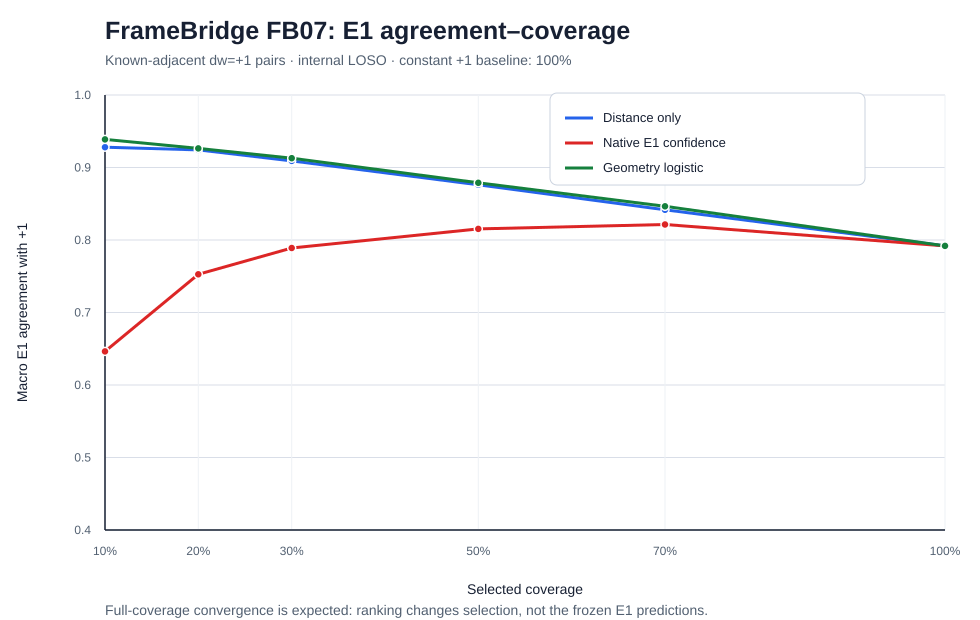

# FB07 — Leave-One-Segment-Out Confidence Ranking

Date: 2026-09-22
Experiment: E0011 / FB07
Evidence class: **internal leave-one-segment-out cross-validation after FB06; not new held-out evidence**
Outcome: **geometry model passes the locally specified primary gate, with a modest gain over a strong distance-only baseline**

## Executive result

FB07 asks whether pair reliability can be ranked across segments after the heterogeneous FB06 result. Four rotations were run. In each rotation, all learned parameters and feature standardization came from three segments and the fourth segment was ranked without using its labels for fitting.

Primary metric: macro mean exact accuracy at 30% coverage.

| Method | Macro accuracy | Worst segment | Pooled accuracy | Selected pairs |
|---|---:|---:|---:|---:|
| Distance only | 0.909126 | 0.790027 | 0.906569 | 19,897 |
| Native E1 confidence | 0.788943 | 0.518077 | 0.777755 | 19,897 |
| **Geometry logistic** | **0.912847** | **0.828495** | **0.910640** | 19,897 |

The locally specified “promising” gate is satisfied: the geometry model exceeds both baselines in macro E1 agreement and improves rather than reduces worst-segment agreement. The gain over distance-only is only 0.37 percentage points macro, however, and geometry is worse on three of four individual folds; distance remains the dominant practical baseline. The protocol and result entered public Git history together, so this is not independently verifiable public preregistration.

**Single-target limitation (2026-09-23 audit):** every local pair has true `dw=+1`; a constant `+1` predictor scores 100% at any selected coverage. FB07 ranks where E1 itself is correct on this known-adjacent diagnostic. It does not measure constraint-generation precision among unknown candidate pairs or improvement to spiral fitting.

## Claim boundary

All four segment outcomes were already known when the FB07 protocol was written. Leave-one-segment-out fitting prevents direct within-fold label leakage, but this is still internal model-selection evidence. FB07 cannot be presented as a new untouched test.

The appropriate claim is:

> Pair geometry provides a transferable reliability ranking across the four observed eligible segments; a small multifeature model adds modest value beyond distance alone, while native E1 rounding confidence does not generalize well.

## Accuracy–coverage summary

### Macro mean accuracy

| Coverage | Distance only | Native confidence | Geometry logistic |
|---:|---:|---:|---:|
| 10% | 0.927954 | 0.646316 | **0.938781** |
| 20% | 0.924215 | 0.752731 | **0.926403** |
| 30% | 0.909126 | 0.788943 | **0.912847** |
| 50% | 0.876147 | 0.815365 | **0.878834** |
| 70% | 0.841672 | 0.821348 | **0.846430** |
| 100% | 0.791930 | 0.791930 | 0.791930 |

### Worst-segment accuracy

| Coverage | Distance only | Native confidence | Geometry logistic |
|---:|---:|---:|---:|
| 10% | 0.891000 | 0.464209 | **0.897000** |
| 20% | 0.858670 | 0.505744 | **0.881646** |
| 30% | 0.790027 | 0.518077 | **0.828495** |
| 50% | 0.677354 | 0.521535 | **0.712087** |
| 70% | 0.586183 | 0.508855 | **0.601756** |
| 100% | 0.455969 | 0.455969 | 0.455969 |

At every selective coverage, the geometry model has the best macro mean and the best worst-segment value. Its practical advantage is most meaningful on the weak segment, not on the already strong segments.

## Per-segment geometry-model results

| Held-out segment | Full | 10% | 20% | 30% | 50% | 70% |
|---|---:|---:|---:|---:|---:|---:|
| `20231005123336` | 0.4560 | **0.9546** | 0.8816 | 0.8285 | 0.7121 | 0.6018 |
| `20231012184424` | 0.8672 | **0.9850** | 0.9748 | 0.9605 | 0.9309 | 0.9099 |
| `20231016151002` | 0.9207 | 0.9185 | 0.9310 | 0.9334 | **0.9363** | 0.9358 |
| `20231022170901` | 0.9239 | 0.8970 | 0.9183 | 0.9290 | 0.9360 | **0.9384** |

The confidence rank is especially useful on the weak segment: its top 10% reaches 95.46%, versus 45.60% at full coverage. On the two strongest segments and the pilot, aggressive selection is not always monotone at the smallest coverage because the base accuracy is already high and remaining errors are not perfectly ordered.

## Models and leakage controls

### Distance-only baseline

Score: negative `log1p(endpoint distance)`. This requires no fitting and directly tests the FB06E hypothesis.

### Native-confidence baseline

Score: frozen E1's distance from the nearest rounding boundary. This confidence is high whenever the scaled integral is near any integer, including confidently wrong integers such as 2 or 3. Its poor weak-segment result is therefore mechanistically plausible.

### Geometry logistic model

Fixed features:

1. `log1p(endpoint distance)`;
2. native E1 confidence;
3. angular separation around the public umbilicus;
4. absolute z displacement divided by endpoint distance;
5. xy chord alignment with the outward radial direction;
6. log-distance × angular-separation interaction.

The predicted winding number was deliberately excluded because, on an all-`dw=1` diagnostic, using `prediction == 1` would restate the correctness label.

Each training segment contributed equal total weight, preventing the 20,000-pair segments from dominating smaller segments. Features were standardized on the training folds only. Deterministic L-BFGS-B optimized weighted logistic loss with L2 coefficient 1.0.

## Coefficient stability

Coefficients are small because of the fixed L2 penalty. Across the three folds that train on the weak segment, standardized log-distance is consistently the largest negative term (approximately −0.163 to −0.168), followed by negative absolute-z fraction (approximately −0.139 to −0.147). The fold holding out the weak segment learns much smaller magnitudes because its three training segments are all strong.

This is important: the model generalizes enough to improve the weak held-out fold, but coefficient variation confirms that four segments are insufficient for a stable universal calibration.

## What FB07 supports

1. Distance is a transferable reliability signal, not merely a pooled post-hoc coincidence.
2. Additional geometry gives a small but consistent macro/worst-segment improvement.
3. Native E1 rounding confidence is not a sufficient cross-segment reliability score.
4. Selective evidence can be useful even when full-coverage E1 is heterogeneous.
5. A future public interface should expose accuracy–coverage behavior and reason-coded abstention rather than emit every constraint equally.

## What FB07 does not support

1. New held-out evidence.
2. A claim that logistic regression materially transforms performance beyond distance.
3. A universal absolute confidence threshold; FB07 ranks within a requested coverage.
4. A claim about the five meshes outside the local-pair protocol.
5. Replacing the full-coverage FB06 score with a selective score.

## Decision

Use distance-only as the default transparent reliability baseline and retain the geometry model as a small optional improvement. Do not spend GPU time on confidence modeling. Package the result as an accuracy–coverage tool with explicit segment-level reporting.

The next value-producing work is release engineering:

- one-command reproduction on cached/pinned small artifacts;
- a compact accuracy–coverage visualization;
- a failure gallery for long-chord over-counting;
- explicit AI disclosure and claim boundaries;
- an upstreamable FrameBridge/sparse-evaluation interface.

## Reproducibility

Protocol: `docs/29_fb07_confidence_protocol.md`
Runner: `scripts/run_framebridge_fb07.py`
Result: `artifacts/framebridge/FB07_loso_confidence.json`
Inputs: SHA-pinned in the result, including pair caches, pair-level diagnostics, ray plan, error analysis, and umbilicus.
